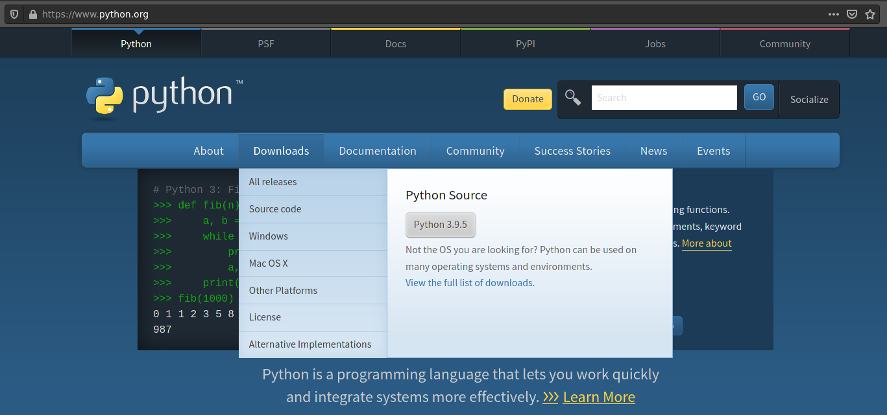
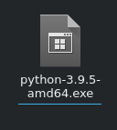

# Summer Python Bootcamp

## Настройка рабочего окружения

### Установка Python для Windows: 

1. Перейти на сайт python.org
2. Навести курсор на вкладку Downloads.
   
   
3. Нажать на кнопку с версией. 
4. Ждать. 
5. Найти файл-установщик в папке загрузок.
   
   
6. Установить python. 
7. Радоваться :)

### Установка IDE на выбор

* [PyCharm Community Edition(recommended)](https://www.jetbrains.com/ru-ru/pycharm/download/#section=linux)
* [VS Code](https://code.visualstudio.com/docs/setup/setup-overview)
* [Sublime Text](https://www.sublimetext.com/download)

## Список задач

* [Задача №1](./task1.md)
* [Задача №2](./task2.md)
* [Задача №3](./task3.md)
