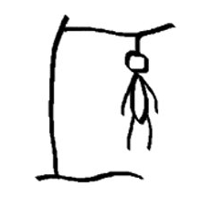

# Задача №2

Реализовать игру "Виселица". 
 

## Правила игры "Виселица" 

Ведущий загадывает слово и рисует такое количество подчёркиваний, сколько букв в слове (например, если загадано слово "кот", то будет нарисовано "_ _ _"). Игрок начинает называть буквы, чтобы отгадать слово. Если буква есть в слове, то ведущий обязан вписать её на своё место в слово (если таких букв несколько, то вписываются все). Игрок имеет право на 10 ошибок. 
 
Если игрок не успел угадать слово прежде, чем попытки закончились - он проиграл. 
 
В данном задании Вам необходимо реализовать игру "Виселица". Для получения слова, которое надо отгадать, в программе необходимо составить кортеж или список из 10-15 слов и выбрать из них случайное. Далее необходимо "отрисовать" чёрточками загаданное слово (по количеству букв). Затем реализуется цикл игры.